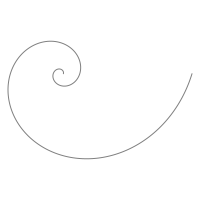
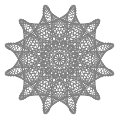
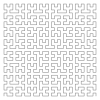
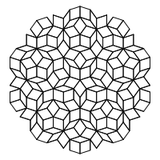
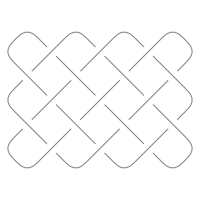
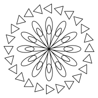

---
hide:
  - navigation
---

# geomotif

A library for generating and plotting geometric designs, and for controlling
exactly where the points along them land.

<div class="strip" markdown>
{ .motif }
{ .motif }
{ .motif }
{ .motif }
{ .motif }
{ .motif }
</div>

```bash
pip install geomotif
```

Zero dependencies for the core, Python 3.12+. matplotlib and scipy are optional
extras, and nothing on the path from a motif to an SVG file needs either.

## The whole mental model

A **motif** is a parameterized recipe for geometry. Applying a **transform** to
what it produced gives a **design**, which is what you plot or export.

```python
from geomotif import PowerSpacing
from geomotif.motifs import SpiralBetween

design = SpiralBetween(start=(200, 0), end=(20, 0), turns=3).generate(
    120, spacing=PowerSpacing(2.5)
)

for x, y in design:
    ...
```

Three sentences is the whole of it:

- `build()` gives a motif at its native resolution — whatever the shape itself
  says it takes to draw.
- `generate()` gives the points you actually want, placed by **arc length**:
  equal spacing means the same real x,y distance between every consecutive
  pair, however tightly the curve winds.
- Everything is immutable, and every operation returns something new.

## Why arc length is the point

Most plotting code spaces points by *parameter* — equal steps through whatever
variable the formula happens to use. On a spiral that puts the points bunched
up at the tight end and stretched out at the wide end, which is not what "100
evenly spaced points" is supposed to mean.

geomotif measures the curve with a dense polyline, builds a cumulative-length
table, and inverts it. That machinery lives in
[`geomotif.core.sampling`][geomotif.core.sampling] and works on *polylines*
rather than on formulas — so it applies to every motif in the catalogue,
including the ones with no closed-form parametrization at all, and to yours.

[Where the points land →](guide/points.md){ .md-button }

## What is in the box

[146 motifs](catalogue.md) across 19 families: the spirals, the primitives, the
named curves, the roulettes, the polar and harmonic family, the fractals, the
graph and number art, string art, the tilings — periodic and aperiodic — sacred
geometry, guilloché, Islamic strapwork, Celtic knotwork, the polyhedra, the
optical illusions, the Voronoi family, and the composers that build motifs out
of other motifs.

Every one of them is a small declarative object, resamples by arc length, takes
every spacing curve, and exports to SVG, DXF, CSV, TXT, JSON and a spec file.

[See all of them →](gallery/index.md){ .md-button }

## Writing your own

Usually it is the maths and nothing else. Pick the base that matches how your
design is *defined*, and write the one method it asks for:

```python
import math
from dataclasses import dataclass

from geomotif import PolarMotif, register


@register("my-flower", family="polar")
@dataclass(frozen=True, slots=True)
class MyFlower(PolarMotif):
    """A seven-lobed flower with a ripple on it."""

    k: float = 7.0

    def radius(self, theta: float) -> float:
        return math.sin(self.k * theta) + 0.4 * math.cos(17 * theta)
```

That class now has arc-length resampling, every spacing curve, the transform
layer, SVG/DXF/CSV/JSON export, spec serialization, generated command-line
flags and lookup by name. `MyFlower(k=5).generate(400)` works, and so does
`geomotif render my-flower --k 5 --out flower.svg`.

You are not required to inherit at all: anything with a `build() -> Design`
method satisfies the [`SupportsBuild`][geomotif.core.motif.SupportsBuild]
protocol and is accepted everywhere a motif is.

[Extending geomotif →](extending.md){ .md-button }

## Where to go next

- **[Where the points land](guide/points.md)** — arc length, spacing curves,
  fixed-step placement, and how a point budget is spread across a design that
  has several strokes.
- **[Designs, paths and transforms](guide/designs.md)** — the data model, and
  the operators that turn one shape into a pattern.
- **[Exporting](guide/export.md)** — SVG, DXF, CSV, TXT, JSON, and the spec
  format that records the recipe instead of the points.
- **[Plotting](guide/plotting.md)** — the matplotlib helpers, behind the `plot`
  extra.
- **[The command line](guide/cli.md)** — `geomotif render`, `geomotif gallery`,
  and where the flags come from.
- **[Extending](extending.md)** — the base classes, the conformance contract,
  and publishing a motif as a plugin.
- **[API reference](reference/index.md)** — every public module, generated from
  the docstrings.
